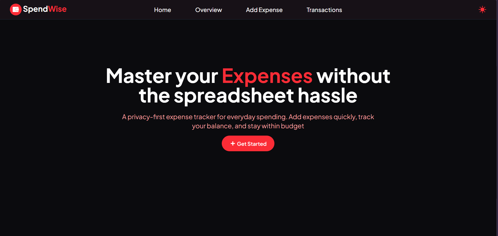
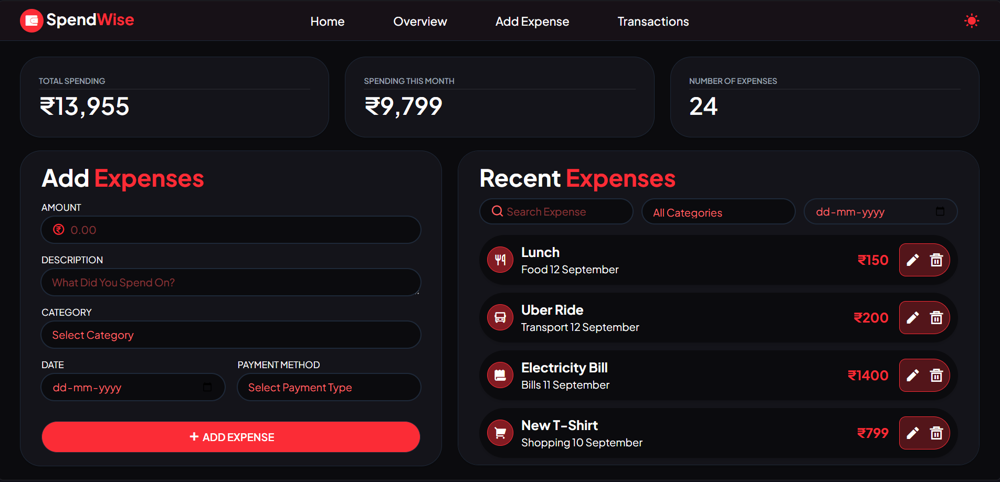
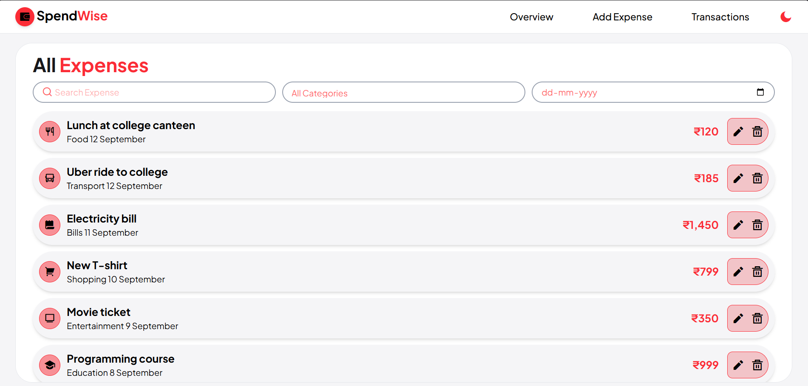
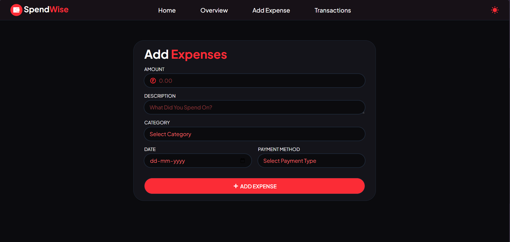

# SpendWise

A modern and responsive expense tracking application built with React and Tailwind CSS.

SpendWise allows users to add, edit, delete, search, and filter expenses through a simple dashboard.

## Live Demo

[View Live Demo](https://expense-tracker-pied-six-82.vercel.app/)

## Features

- Add, edit, and delete expenses
- Track expense amount, category, date, and payment method
- Search expenses by description, category, or date
- Filter expenses by category and date
- View total spending, current month spending, and total number of expenses
- Dark and light mode

## Screenshots

### Home



### Overview



### Transactions



### Add Expense



## Tech Stack

- React
- JavaScript
- Tailwind CSS
- React Router

## Getting Started

### Clone the repository

```bash
git clone (https://github.com/samvesh-cs/spendwise)
```

### Install dependencies

```bash
npm install
```

### Run the development server

```bash
npm run dev
```

## What I Learned

Building SpendWise helped me improve my understanding of React and frontend development.

- Managing state with `useState`
- Using `useContext` for global state management and `useEffect` for handling side effects.
- Sharing data between components using the **Context API**
- Building reusable React components
- Working with controlled form inputs
- Implementing CRUD operations
- Using React Router for client-side navigation
- Using **Tailwind CSS** to build responsive and reusable UI styles
- Structuring a React application into components, pages, and contexts

## Future Improvements

- Expense charts and analytics
- Monthly budgets
- Category-wise spending breakdown
- Backend and database integration
- User authentication
- CSV export

## Author

Built as a React learning project to practice frontend development, state management, responsive design, and CRUD functionality.
